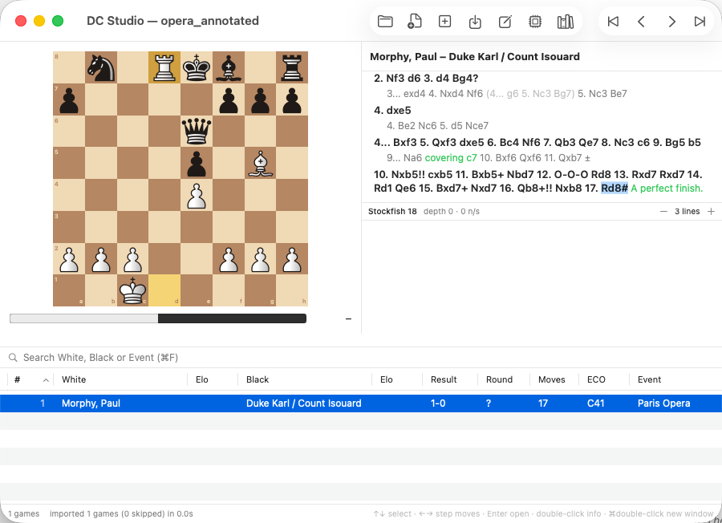

# DC Studio

**A native Mac chess database.** Browse, annotate, analyze and enter games —
a lightweight, PGN-native alternative to ChessBase, built for players and
coaches on macOS. Part of the DanceChess family.



## Features

- **Single-window workflow** — board + notation on top, your game list below.
  Arrow keys browse games and step through moves without ever touching the
  mouse; `Enter` dives into a game, `Esc` comes back.
- **PGN is the source of truth** — open any .pgn and its games *are* the
  list. Every save writes straight back to the file (atomically, with a
  `.pgn.bak` safety copy). SQLite is only a per-file cache: a 100k-game
  file imports in ~2 s and reopens instantly.
- **Full annotation** — variations (promote/delete), `!`/`?` NAGs, eval
  symbols, comments, undo/redo. The notation panel renders a ChessBase-style
  variation tree.
- **Engine analysis** (⌘E) — bundled Stockfish, MultiPV, eval bar, click an
  engine line to insert it as a variation. The engine only runs while a move
  is selected — no idle CPU burn.
- **Opening reference** (⌘T) — move statistics with W/D/L for the current
  position across the open file, and the list filters to the games that
  reach it (transposition-aware).
- **Game entry** — a blank board, a ChessBase-style save mask, and your
  scoresheets become clean PGN. Create a new file and build a collection
  from scratch.

## Requirements

- Apple Silicon Mac, macOS 14 (Sonoma) or later
- To build: Xcode Command Line Tools, Rust, and `brew install stockfish`
  (full Xcode is *not* required)

## Building

```bash
git clone <this repo> && cd <repo>
./scripts/make-app.sh        # → "dist/DC Studio.app", double-clickable
```

Development without Xcode:

```bash
cd core && cargo test        # Rust core: movegen, PGN tree, SQLite (28 tests)
cd app && swift run StudioSmoke   # end-to-end smoke incl. real Stockfish
cd app && swift run StudioApp     # run the app from the CLI
```

An Xcode project is optional: `brew install xcodegen && xcodegen -s app/project.yml`.

## Good to know

- **Saving normalizes your PGN.** DC Studio re-serializes the whole file on
  save: content (moves, variations, comments, headers) is preserved —
  round-trip fidelity is test-covered — but formatting will differ from the
  original. A `.pgn.bak` of the pre-session file sits alongside.
- Alpha software, tested primarily by its author. Rough edges are tracked in
  [docs/ROADMAP.md](docs/ROADMAP.md); the architecture lives in
  [docs/ARCHITECTURE.md](docs/ARCHITECTURE.md) and the notation-panel design
  in [docs/NOTATION-VIEW.md](docs/NOTATION-VIEW.md).

## License

GPLv3 — see [LICENSE](LICENSE). DC Studio stands on GPL shoulders:
[Stockfish](https://stockfishchess.org) (bundled engine),
[shakmaty](https://github.com/niklasf/shakmaty) (move generation),
and the Merida piece set by Armando Hernandez Marroquin.
